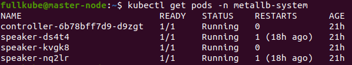
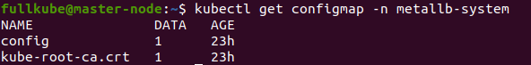

# Working with Ingress

## Steps
* K8s cluster with two slaves and one master
* Simple app deployed on default[or custom] namespace
* Installed MetalLB
* Installed Nginx ingress controller
---
> Note that there is no difference in installation order. You can attach MetalLB even if there already installed Nginx Ingress Controller

## K8s cluster

   Lets check our cluster:

   

   > If you need cluster creation guide go to mkCluster folder and folow instructions

## Simple app deployment

   > You can find an example app in the AppExmpl folder, but this guide should work for any app

   ---

   For this particular guide, we are using the `default` namespace. To check your namespace run: `kubectl config view --minify | grep namespace`  
   If return is empty you are in default namespace

   To deploy the example app `cd` into src/ folder and run the next command - `kubectl apply -f test-deployment.yaml`

   As a result, we should acquire a new service with ten pods allocated to two slave nodes

   Created `htttpd-service`:

    


   Created `pods`:

   

   >Notice that for properly working ingress with DNS name, your service should be of type `ClusterIP `

## Installing MetalLB

   >This part heavily references metalLB documentation in case of any problems goto https://metallb.universe.tf/installation/ 

   ---

   ### Configuring ARP mode

   If you’re using kube-proxy in IPVS mode, since Kubernetes v1.14.2 you have to enable strict ARP mode.
   _Note, you don’t need this if you’re using kube-router as service-proxy because it is enabling strict ARP by default_.

   You can configure ARP by editing kube-proxy config in current cluster: `kubectl edit configmap -n kube-system kube-proxy`

   And enable ARP by setting:

   ```yaml
   apiVersion: kubeproxy.config.k8s.io/v1alpha1
   kind: KubeProxyConfiguration
   mode: "ipvs"
   ipvs:
     strictARP: true

   ```

   If you are trying to automate this change, these shell snippets may help you:

   ```yaml
   # see what changes would be made, returns nonzero returncode if different
   kubectl get configmap kube-proxy -n kube-system -o yaml | \
   sed -e "s/strictARP: false/strictARP: true/" | \
   kubectl diff -f - -n kube-system

   # actually apply the changes, returns nonzero returncode on errors only
   kubectl get configmap kube-proxy -n kube-system -o yaml | \
   sed -e "s/strictARP: false/strictARP: true/" | \
   kubectl apply -f - -n kube-system
   ```

   ### Installing MetalLB

   For MetalLB to properly work in your Kubernetes cluster we need to create a namespace for MetalLB where we will deploy needed resources

   `kubectl apply -f https://raw.githubusercontent.com/metallb/metallb/v0.10.2/manifests/namespace.yaml`

   After namespace creation, we can deploy MetalLB to our Kubernetes cluster, fortunately enough we don`t need to configure the metallb installation as we use the official YAML file

   `kubectl apply -f https://raw.githubusercontent.com/metallb/metallb/v0.10.2/manifests/metallb.yaml`

   This will provide our cluster with:
   1. MetalLB namespace `metallb-system`
   2. Two metallb structures:
   * `metallb-system/controller` deployment, which is the cluster wide controller that handles IP adresses assigments
   * `metallb-system/speaker` deamonset, this is the component that speaks the protocol(s) of your choice to make the services reachable

   To check status of MetalLB pods run:
   `kubectl get pods -n metallb-system`. You'll be provided with next information:

   

   ### Configuring MetalLB for use in K8s cluster

   >MetalLB remains idle until configured. This is accomplished by creating and deploying a config map into the same namespace (metallb-system) as the deployment.

   ---

   Depending on the protocol(s) you want to use there are different configurations:
   
   * Layer 2 configuration
   * BGP configuration
   * Advanced configuration

   For beginner simplicity, we will use Layer 2 configuration. Its main principle is to get control of a specific pool of IP addresses. 
   Layer 2 mode does not require the IPs to be bound to the network interfaces of your worker nodes. It works by responding to ARP requests on your local network directly, to give the machine’s MAC address to clients.

   Content of config.yaml below:

```yaml
   apiVersion: v1
   kind: ConfigMap # points that it's external configuration of metallb-system
   metadata:
     namespace: metallb-system # namespace affected by ConfigMap
     name: config
   data:
     config: | # configuration part
       address-pools: # pool of allocated addresses
       - name: default
         protocol: layer2 # protocol to use
         addresses:
         - 192.168.45.10-192.168.45.15 # allocated pool of addresses
```

   > Feel free to change allocated ip addrs quantity, range. Since my cluster nodes ip addresses are 192.168.43.131-192.163.43.133 I used the ones above.

   Now we can apply changes to our load balancer by running: `kubectl apply -f config.yaml --namespace=metallb-system`

   To check if you were successful run: `kubectl get configmap -n metallb-system`  
   Result:

   

   In the end your resources should look similar to:

   

## Installing Nginx Ingress Controller

   There are a lot of different ingress controllers suitable for Kubernetes, some of them are pay-to-use, others are free. In this guide, we will use [Nginx Ingress Controller](https://kubernetes.io/docs/concepts/services-networking/ingress-controllers/).   
   [Documentation](https://github.com/kubernetes/ingress-nginx/blob/main/README.md#readme) for Nginx Ingress Controller
   and 
   [Difference](https://docs.google.com/spreadsheets/d/191WWNpjJ2za6-nbG4ZoUMXMpUK8KlCIosvQB0f-oq3k/edit#gid=907731238) between the controllers.


   Since we are using official [guide](https://kubernetes.github.io/ingress-nginx/deploy/) we can simply run the following command - `kubectl apply -f https://raw.githubusercontent.com/kubernetes/ingress-nginx/controller-v1.0.0/deploy/static/provider/baremetal/deploy.yaml`.

   To monitor installation process we can use `kubectl get pods -n ingress-nginx \
   -l app.kubernetes.io/name=ingress-nginx --watch` and simply use Ctrl+C to cancel command.

   

   This will install Nginx Ingress Controller into its own namespace, but since we use bare-metal installation it will use NodePort as a service type. To use our Ingress with full capabilities we need to change the service type to LoadBalancer, so MetalLB could take control of balancer and allocate an external address from the range that we specified earlier. Lets check Ingress status by running `kubectl -n ingress-nginx get all`

   

   Now it is time to change service type of our ingress-nginx-controller from NodePort to LoadBalancer. Simply run `kubectl edit svc ingress-nginx-controller -n ingress-nginx` and change corresponding field at spec.type

   

   Check changes with `kubectl -n ingress-nginx get svc`

   

   Now that we have configured Ingress with the appropriate type and external-ip we can attach ingress to our sample application.

## Attaching Ingress

   Now we can create our Ingress by running `kubectl apply -f example-ingress.yaml`

   Content of example-ingress.yaml:

   ```yaml
   apiVersion: networking.k8s.io/v1
   kind: Ingress
   metadata:
     name: example-ingress
     annotations:
       kubernetes.io/ingress.class: nginx
   spec:
     rules:
       - host: myapp.exmpl.com
         http:
           paths:
             - path: /
               pathType: Prefix
               backend:
                 service:
                   name: httpd-service
                   port:
                     number: 80
   ```
  
  To check if Ingress was created run `kubectl get ingress`

  

  >Note that Address may be different or even blank. To get to app use HOSTS DNS address

  Last step would be adding External-Ip and Hosts to /etc/hosts, use `sudo nano /etc/hosts` to edit.

  

  Results:

  From using DNS name with relocation via MetalLB(LoadBalancer)

  

  From using ClusterIP

  

  From using one of the pods ip address

  

  You also can check LoadBalancer address in our case 192.168.45.10. Since this address is in use by NGINX ingress which is controlled with MetalLB, we will get a standard 'empty' nginx response

  

---

## Congrats it's EOF
